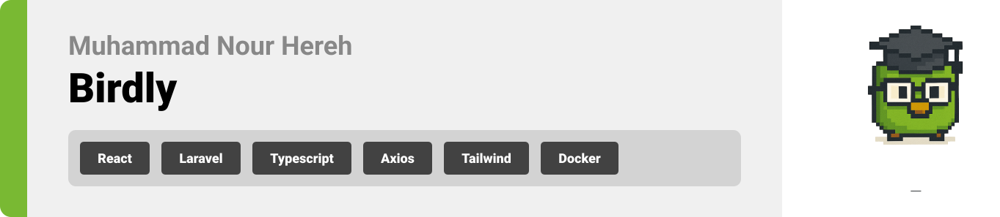

  

<!-- project overview -->

> A gamified learning platform designed to make studying more fun and interactive.
> 
> The platform features a beautiful pixel-art inspired map where users "travel" as they complete quizzes and lessons. It supports multiple types of questions (written, multiple-choice, matching) and can embed images, videos, and simulations into the quizzes.

  

<!-- System Design -->

### Add Title Here

- **web**: React.
- **mobile**: React native.
- **Backend**: Laravel.
- **Database**: mysql, monogdb.

  

<!-- Project Highlights -->

### Add Title Here

- Pixel-art inspired game map navigation
- Dynamic quizzes with various types (write, choose, match)
- Embeddable media (images, audio, videos)
- Cool animations and transitions
- Track user learning progress like an RPG game
- Responsive design for mobile and desktop
- Admin panel for managing quizzes and tracking user data

  

<!-- Demo -->

### User Screens (Mobile)

| Login screen                            | Register screen                       | Register screen                       |
| --------------------------------------- | ------------------------------------- | ------------------------------------- |
|  |  |  |

### Admin Screens (Web)

| Login screen                            | Register screen                       |
| --------------------------------------- | ------------------------------------- |
|  |  |

  

<!-- Development & Testing -->

### Add Title Here

- using docker for containers
- github action for ci/cd
- build in testing in laravel

| Services                            | Validation                       | Testing                        |
| --------------------------------------- | ------------------------------------- | ------------------------------------- |
|  |  |  |

  

<!-- Deployment -->

### Add Title Here

- Project is containerized using Docker for easy deployment.
- APIs are documented with Postman collections.
- Live demo and staging environments available.

| Postman API 1                            | Postman API 2                       | Postman API 3                        |
| --------------------------------------- | ------------------------------------- | ------------------------------------- |
|  |  |  |

  
