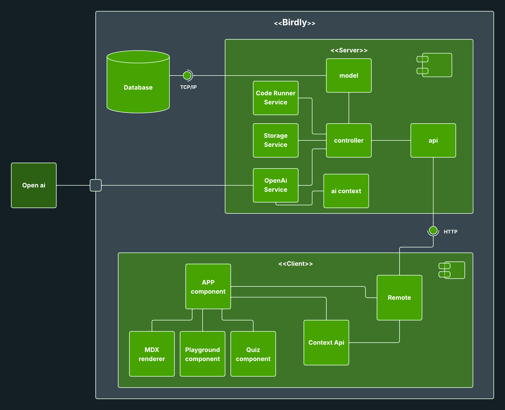
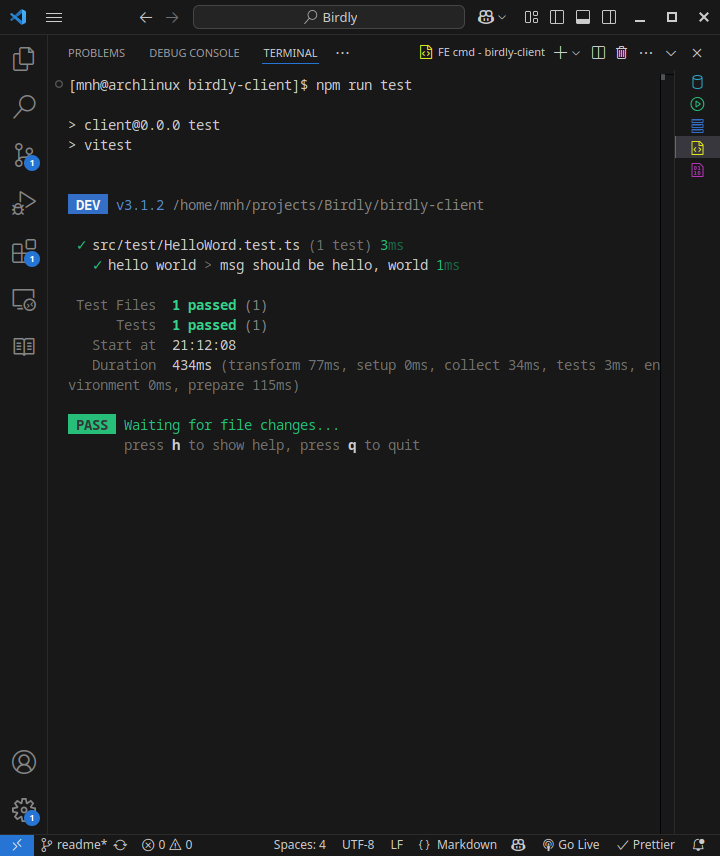
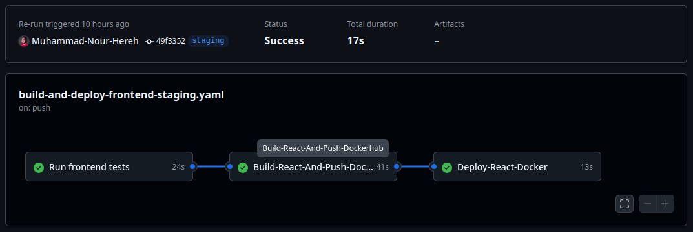

  

<!-- project overview -->

> Birdly is an SPA web platform designed to help users learn various subjects, such as programming languages and computer science concepts.
> It features learning through solving questions, gamification elements, an AI assistant, and a playground to write and test code with AI-powered hints.

  

<!-- System Design -->

<!-- ### Stack, Diagrams, and Flow

- **web**: React, typescript, tailwind, shadcn/ui, framer-motion, react-mdx, vitest, axios, context api.
- **Backend**: Laravel, flysystem, pest, elequent, openai-php.
- **Database**: mysql.
- **CI/CD**: docker, docker-compose, github action, ec2 -->

| ER Diagram                                |
| ----------------------------------------- |
|  |

| Component Diagram                        |
| ---------------------------------------- |
|  |

| EC2 instance anatomy                |
| ----------------------------------- |
|  |

  

<!-- Project Highlights -->

 

  

### Features

- Quizzes: Four types of questions - Select, Order, Write, and Match.
- Practice: Dynamically generated quizzes based on the user’s past mistakes.
- Playground: A coding space to write and run code snippets, with an AI assistant for help.
- Guildbooks: Short, focused pages on topics like variables or functions, featuring runnable snippets and AI assistance.
- Cheat Sheets: Downloadable PDF references.
- Map: A world map where players progress by completing levels.

  

<!-- Demo -->

### Screenshots, and GIFs

| Login screen                                          | Register screen                                        |
| ----------------------------------------------------- | ------------------------------------------------------ |
|  |  |

| Snippets Menu screen                         | Playground screen                           |
| -------------------------------------------- | ------------------------------------------- |
|  |  |

| Select Quiz screen                          | Order Quiz screen                        |
| ------------------------------------------- | ---------------------------------------- |
|  |  |

| Guildbook screen                          | Birdly assistant screen                    |
| ----------------------------------------- | ------------------------------------------ |
|  |  |

  

<!-- Development & Testing -->

### Develpment and Testing

|                                        |                                      |
| -------------------------------------- | ------------------------------------ |
|  |  |
|  |  |
|  |  |

### Testing

| Backend Testing (Pest)                  | Frontend Testing (Vitest)             |
| --------------------------------------- | ------------------------------------- |
|  |  |

  

<!-- Ai integration -->

<!--
* AI Checks for user answer
* AI interactive
* Ai chat
 -->

  

<!-- Deployment -->

### CI/CD, postman and live demo

- Project is containerized using Docker for easy deployment.
- APIs are documented with Postman collections.
- Live demo and staging environments available.

| Postman API 1                             |
| ----------------------------------------- |
|  |
|    |
|    |

<table>
  <thead>
    <tr>
      <th>Testing before merge pull request</th>
      <th>Github Action workflows</th>
    </tr>
  </thead>
  <tbody>
    <tr>
      <td rowspan="2"></td>
      <td></td>
    </tr>
    <tr>
      <td></td>
    </tr>
  </tbody>
</table>

  
